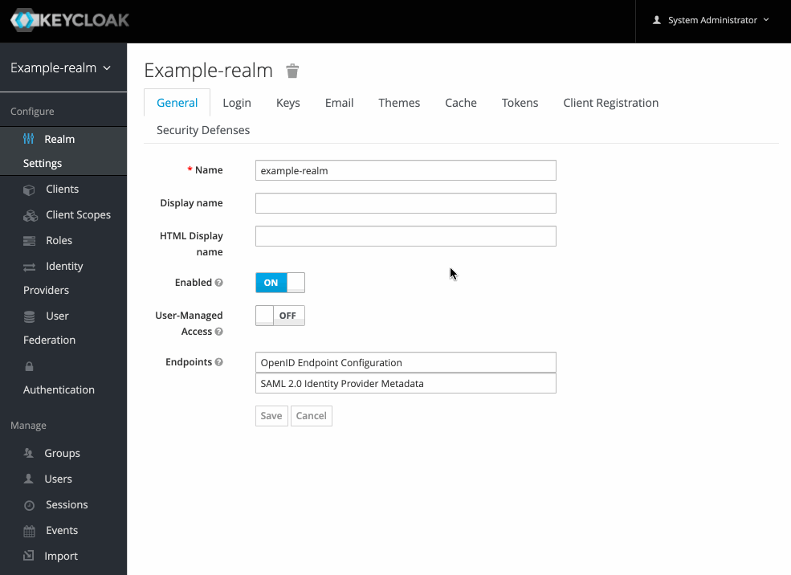
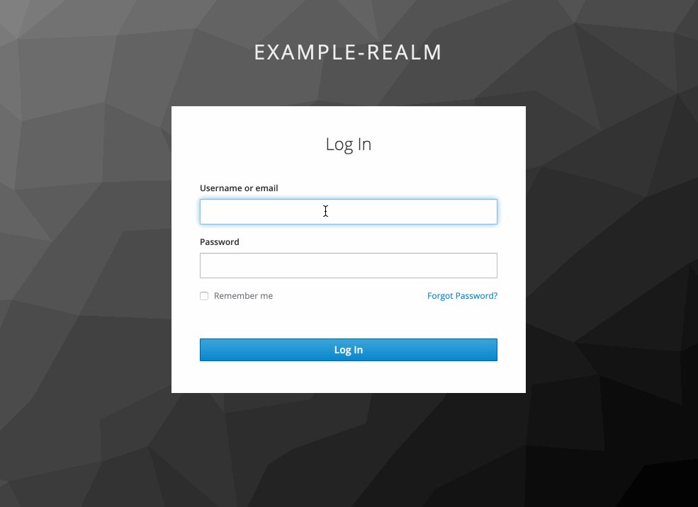

# Auth require group extension

Tested with keycloak 23.0.6 and java 17

This extension provides an authentication action that will require a user to be part of a specified group.

## Installation

Copy the JAR into `/keycloak/providers/`

## Configure

- Copy the `Browser` authentication 
- Add a new execution, select "Required Group"
- Click the newly added execution and specify the group that has access
- On your restricted clients, set this authentication

## Demo

User `in_group` is in the allowed group and can login, user `not_in_group` is not in the allowed group and gets a message stating no access.

this exstention was part of the thomasdarimont keycloak-extension-playground exstention plugin and has been upated to support keycloak 23.0.6 with java 17
